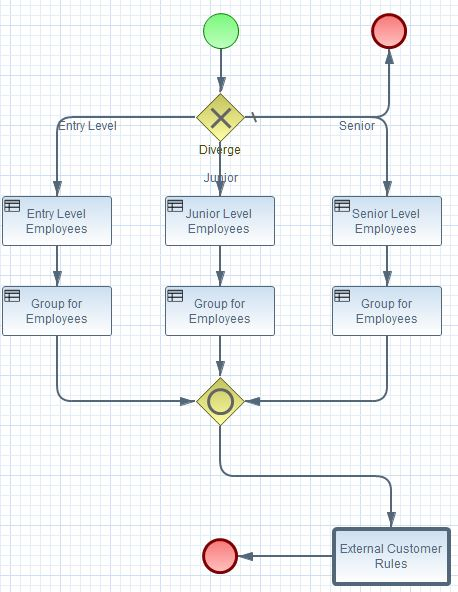

<small>Sunil Samuel 
web_github@sunilsamuel.com 
http://www.sunilsamuel.com
</small>

**
BPMN Subprocess
**

# Overview

Just a sample application using Drools (BRMS) and BPMN.  The objective is to show the following:
1. Create two KJARs with Self-Contained BPMN Process.
2. Import KJAR as Depenency to Another KJAR.
3. Use Imported BPMN Process as Sub-Process Task.

The idea is to show to to use a complete separate BPMN process within another BPMN process
as a sub-process task (Reusable Process).

# Create two KJARs with Self-Contained BPMN Process

There are two KJARs (packaged as kjar) within the maven project, namely `customer-rules` and 
`employee-rules`.  See the pom.xml file for each file to understand the packaging.  Nothing
too difficult here.

# Import KJAR as Depenency to Another KJAR

Use maven dependency to import one kjar into the other.  See the pom.xml for the `employee-rules`
project.

# Use Imported BPMN Process as Sub-Process Task

The `Reusable Process` within the `Sub Process Task` can be used to include one BPMN as a sub-process
to another.

The process within the `employee-rules` KJAR will use the BPMN defined within the `customer-rules`
process as a sub-process task.  The `employee-rules` process is as follows:

The task named `External Customer Rules` has a Call Activity has a Called Element that refers
to the `customer-rules` BPMN process id.

# Technology Stack

* BRMS
* BPMN
* Maven
